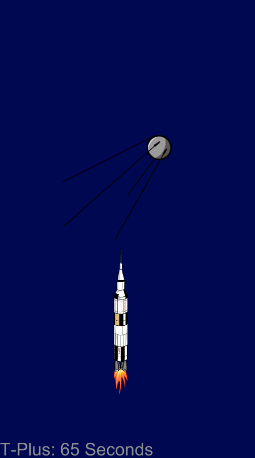
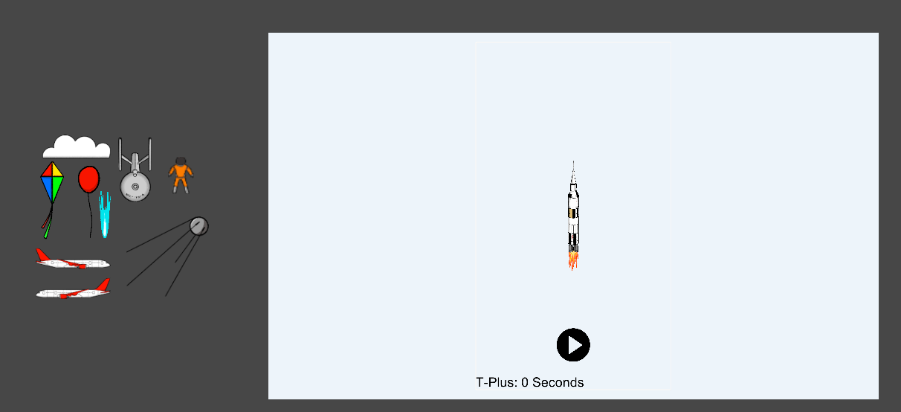

# TakeOffApp

Initally made with JavaFX, TakeOff is an application that has you play as the Saturn V rocket, dodging obstacles on its way into space.

To play, click and drag the rock to dodge the obstacles.

This is an application made in Unity in the programming language C#.
